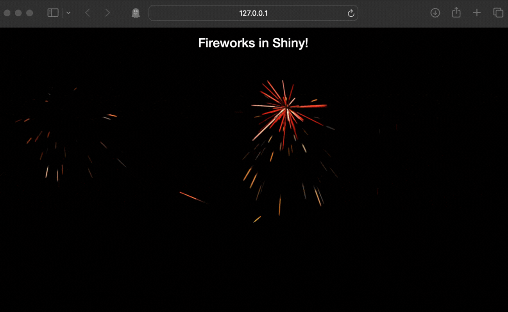

# fireworks 

<!-- badges: start -->

[](https://www.tidyverse.org/lifecycle/#experimental)
[](https://github.com/hypebright/fireworks/actions/workflows/R-CMD-check.yaml)
<!-- badges: end -->

Wrapper around the [fireworks-js](https://fireworks.js.org) lib that can be used in Shiny ✨

## Installation

You can install the development version of `fireworks` from Github with:

``` r
pak::pak("hypebright/fireworks")
```

## Usage

Fireworks in Shiny, how cool is that? ✨🎆 



You can add `fireworks` in the UI, or you can launch and stop fireworks from the server. Examples can be found in `/inst/examples`.

Calling `fireworks()` in the UI:

``` r
library(shiny)
library(fireworks)

ui <-
  fluidPage(
    titlePanel("Fireworks in Shiny!"),
    mainPanel(
      fireworks(id = "myFireworks")
    )
  )

server <- function(input, output) {}

shinyApp(ui, server)
```

In this case, the fireworks is a `<div>` with a specified width and height.

To use fireworks as a full screen overlay or an specific existing HTML element, you can launch and stop fireworks from the server:

``` r
library(shiny)
library(fireworks)

ui <-
  fluidPage(
    titlePanel("Fireworks in Shiny!"),
    useFireworks(), # add dependencies
    actionButton("launch", "Launch fireworks"),
    actionButton("stop", "Stop fireworks")
  )
  
server <- function(input, output, session) {

  # when no id given, fireworks will be a full screen overlay
  fw <- Fireworks$new()

  observe({
    fw$start()
  }) |> bindEvent(input$launch)

  observe({
    fw$stop()
  }) |> bindEvent(input$stop)

}

shinyApp(ui, server)
```

To add fireworks to an individual element, you can use the `id` argument:

``` r
library(shiny)
library(fireworks)

ui <-
  fluidPage(
    tags$title("Fireworks 🎆"),
    tags$h2("Fireworks in Shiny!"),
    useFireworks(),
    actionButton("launch", "Launch Fireworks"),
    plotOutput("plot", width = "100%", height = "400px"),
  )
  
server <- function(input, output, session) {

  fw <- Fireworks$new(id = "plot",
                      options = list(hue = list(min = 0, max = 45),
                                     explosion = 10,
                                     traceSpeed = 5))

  output$plot <- renderPlot({
    plot(cars)
  })

  observe({
    fw$start()
    Sys.sleep(3)
    fw$stop()
  }) |> bindEvent(input$launch)

}

shinyApp(ui, server)
```

## Options

You can pass options to  `fireworks()` and `Fireworks$new()` to customize the fireworks. A full list of options can be found on the [fireworks-js GitHub page](https://github.com/crashmax-dev/fireworks-js/?tab=readme-ov-file#options).

For example:

```r
fireworks(id = "myFireworks",
          options = list(hue = list(min = 0, max = 45),
                         explosion = 10,
                         traceSpeed = 5))
```

or:

```r
fw <- Fireworks$new(options = list(hue = list(min = 0, max = 45),
                                   explosion = 10,
                                   traceSpeed = 5))
```
